# Physically Based Shading

## Different Layer View
### Shaded
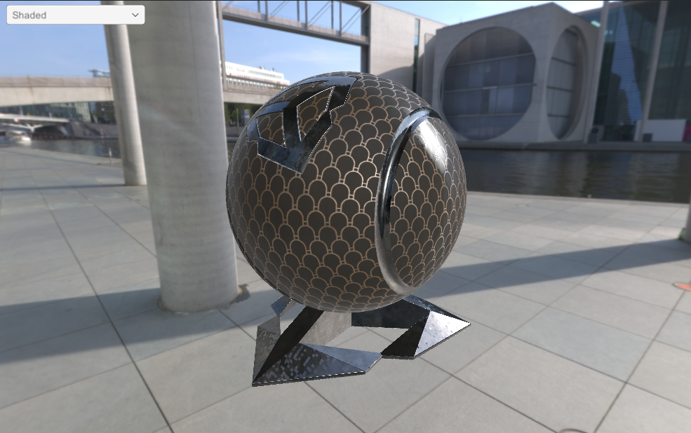

### Albedo
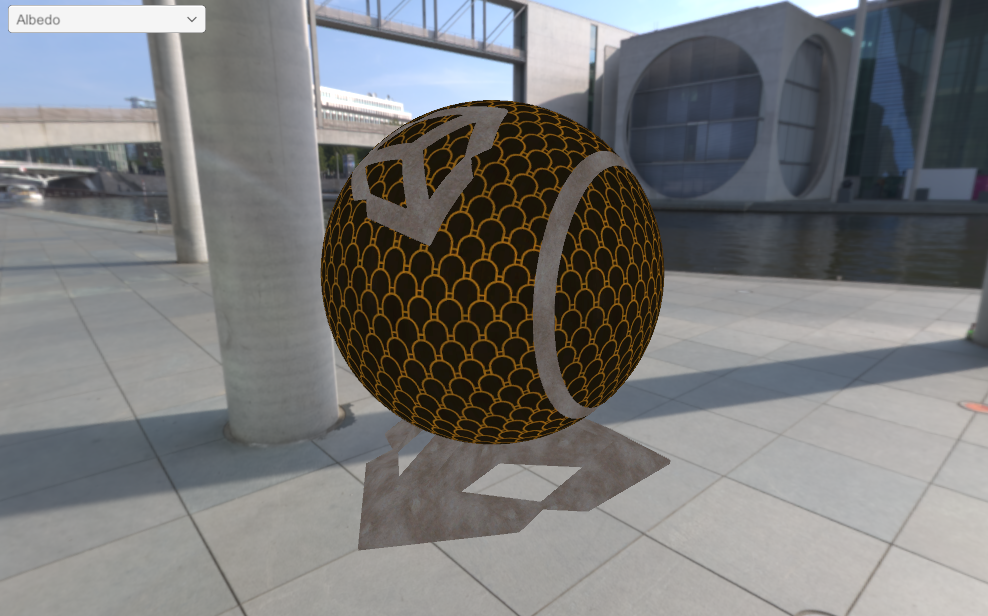

### Ambient Occlusion
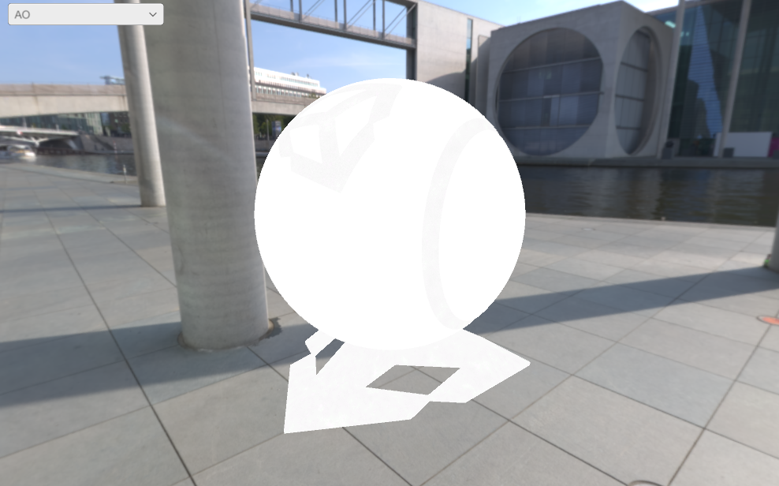

### Normal
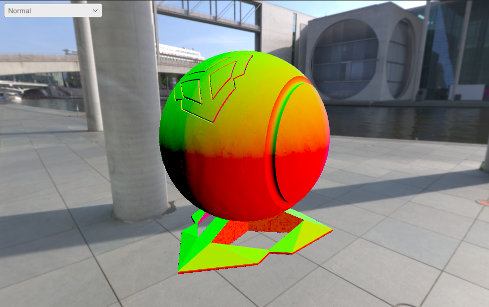

### Metallic
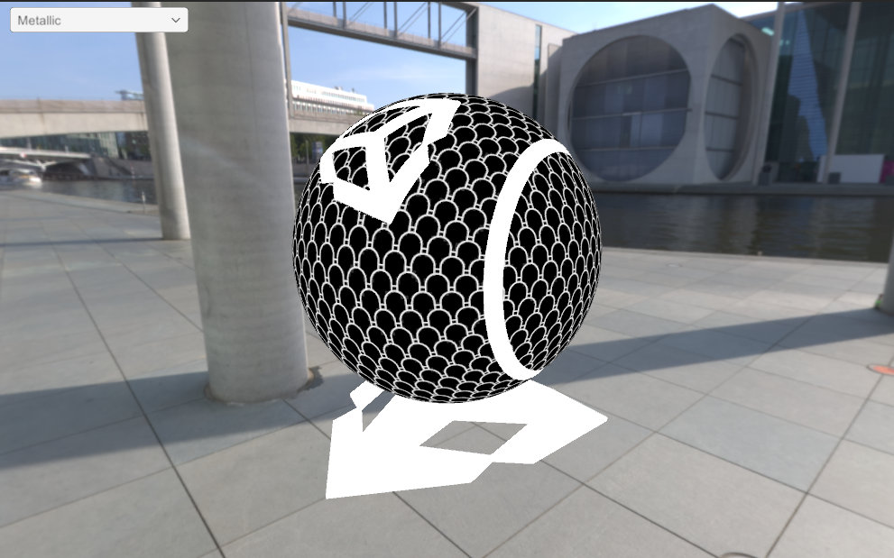

### Roughness
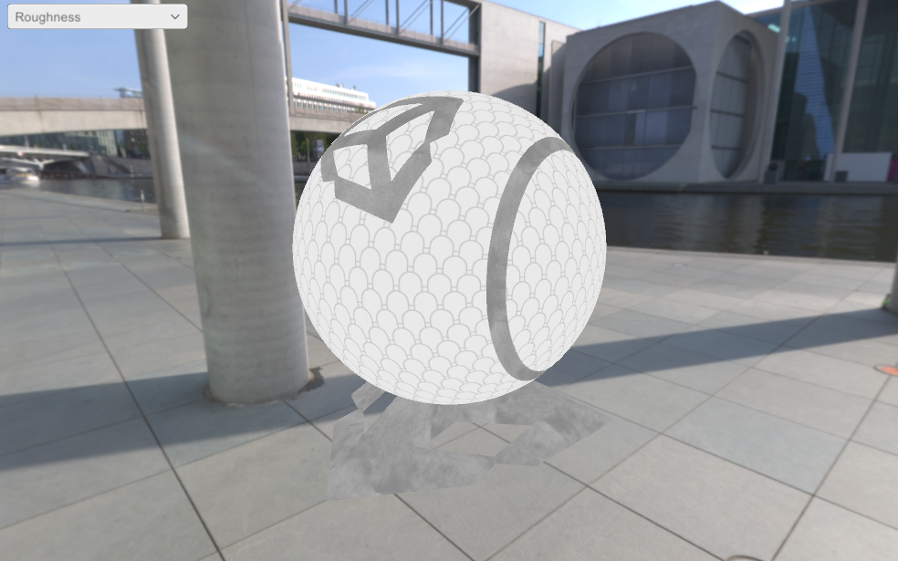

### Direct Light Diffuse
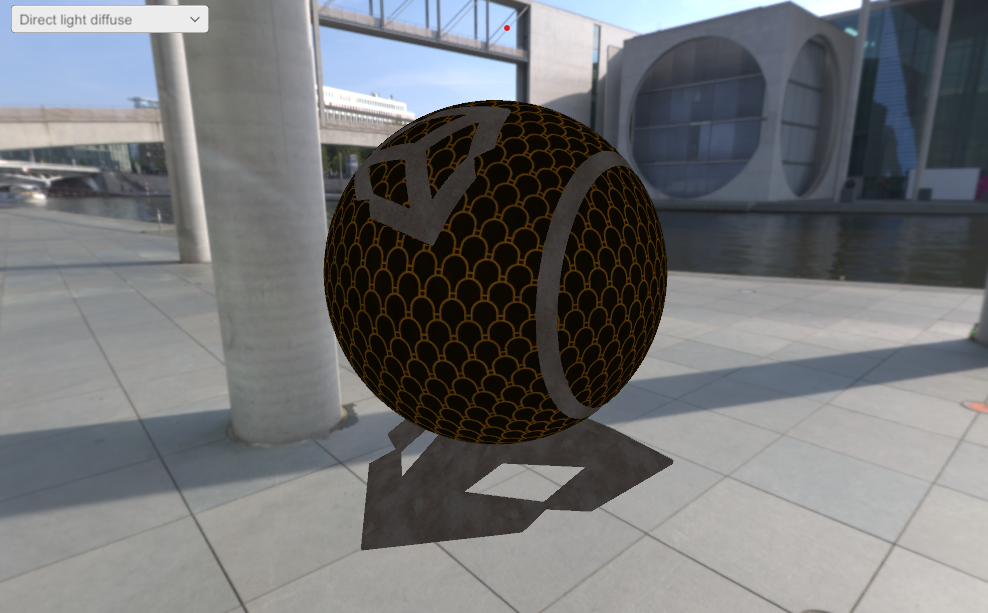

### Direct Light SPECULAR
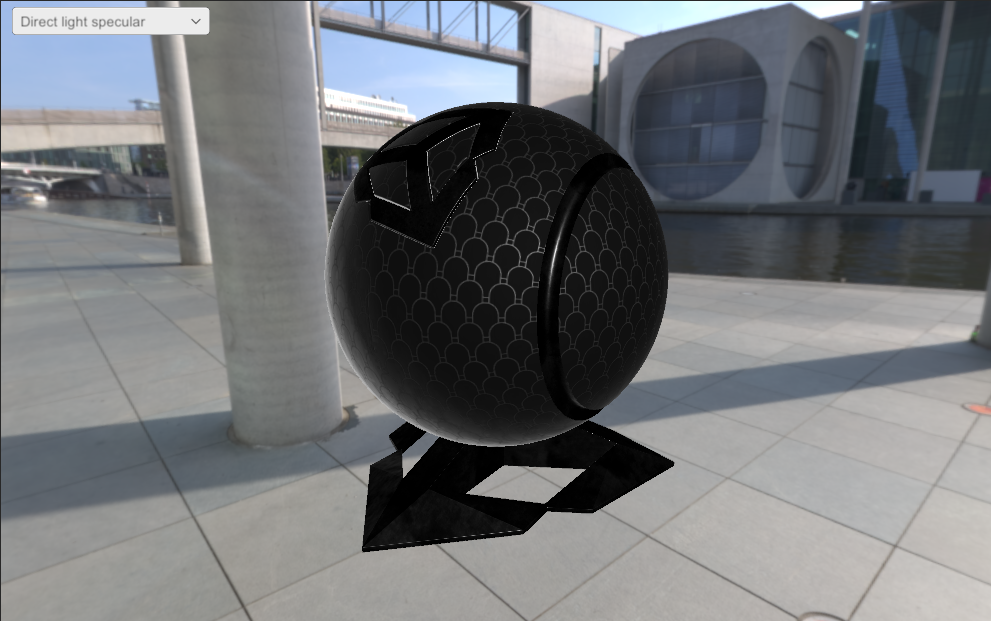

### Indirect Light Diffuse

### Indirect Light SPECULAR
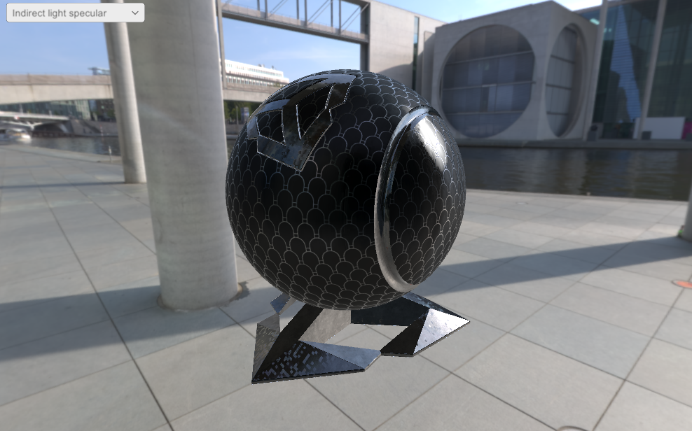

### SH9 Reconstructor
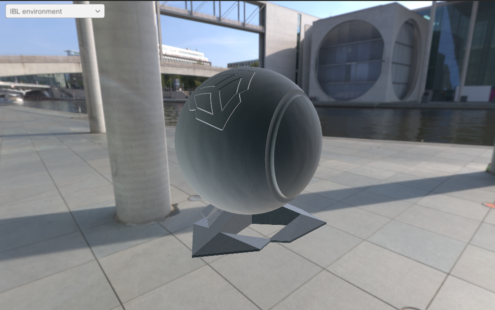

## Generater SH9 and reconstruct the environment texture
<table>
  <td>Original HDR Texture</td>
  <tr>
    <td>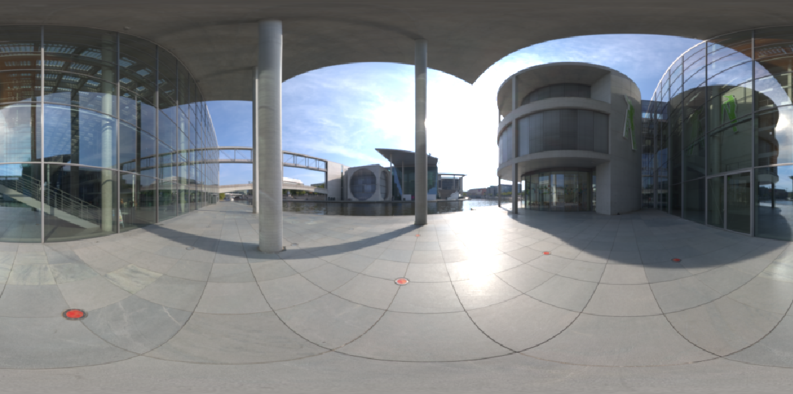</td>
    <td>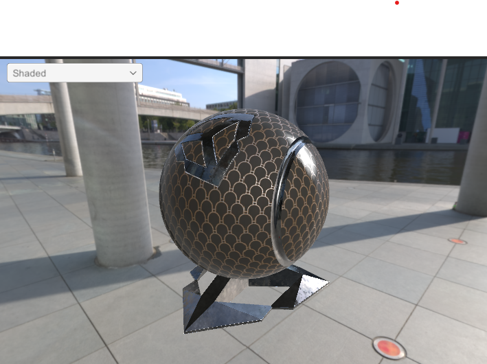</td>
  </tr>
</table>
<table>
  <td>Reconstructed HDR Texture</td>
  <tr>
    <td>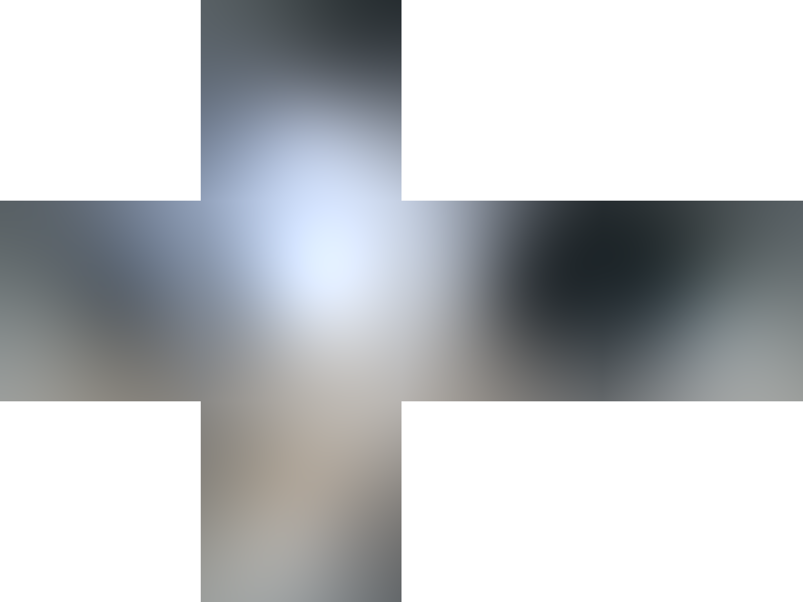</td>
    <td>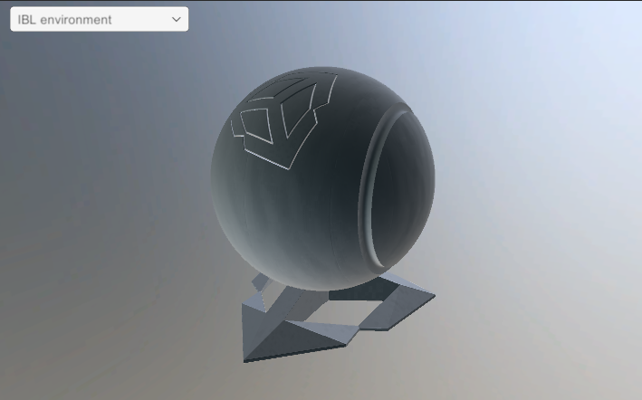</td>
  </tr>
</table>
